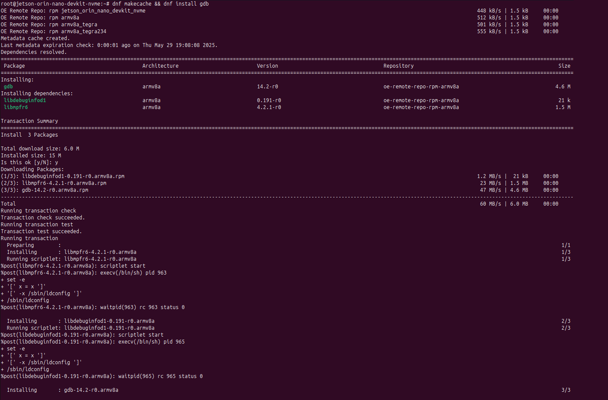
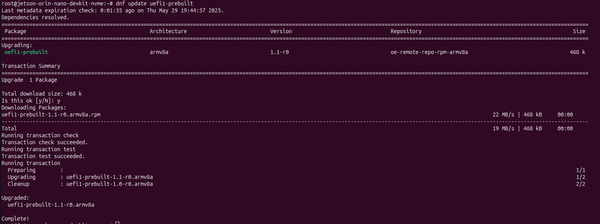

## Setup build machine as server manager

### Host: build machine (also acts as RPM server)
1) Configure Yocto to generate RPMs and enable package management
Add the following to your conf/local.conf (or your distro config):
```bash
PACKAGE_CLASSES = "package_rpm"
EXTRA_IMAGE_FEATURES:append = " package-management"
# Remote repo URL (host machine IP + port)
PACKAGE_FEED_URIS = "http://<server_ip>:8000"
# Feed layout (paths + arches)
PACKAGE_FEED_BASE_PATHS = "rpm"
PACKAGE_FEED_ARCHS = "jetson_orin_nano_devkit_nvme armv8a armv8a_tegra armv8a_tegra234"
```
#### Notes
+ Replace <server_ip> with your build machine IP reachable from the target.

2) Build your image
e.g
```bash
bitbake core-image-minimal
```

3) Generate repo metadata (repodata)
This step creates the RPM metadata that dnf needs:
```bash
bitbake package-index
```
Re-run bitbake package-index any time you add new packages that should appear in the feed.

4) Serve the deploy directory via HTTP
The RPM feed is produced under:
`tmp/deploy/rpm/`

Easiest option: start a Python HTTP server from tmp/deploy so the URL path matches PACKAGE_FEED_BASE_PATHS = "rpm":

```bash
cd build/tmp/deploy
python3 -m http.server 8000
```
If you change the port, update PACKAGE_FEED_URIS accordingly.

### Target: device setup
1) Flash your newly built image
Flash the image you built with package-management enabled.
2) Refresh package metadata and install packages
```bash
dnf makecache
dnf install <package_name>
```

### Development workflow (why this is useful)
During development you’ll often realize the target is missing a tool (e.g. gdb, strace, tcpdump) or want to bump to newer version. Instead of:
+ rebuild image
+ reflash target

You can do:
+ build the package on host
+ update feed index
+ install via DNF on target

### Demo
- [Host]:
```bash
bitbake gdb
bitbake package-index
```

- [Target]:
```bash
dnf makecache
dnf install gdb
```



#### Update package to newer version
Example: Bump uefi1-prebuilt to 1.1
- [Host]: Update PV to 1.1 and rebuild
- [Target]:
```bash
dnf update uefi1-prebuilt
```
